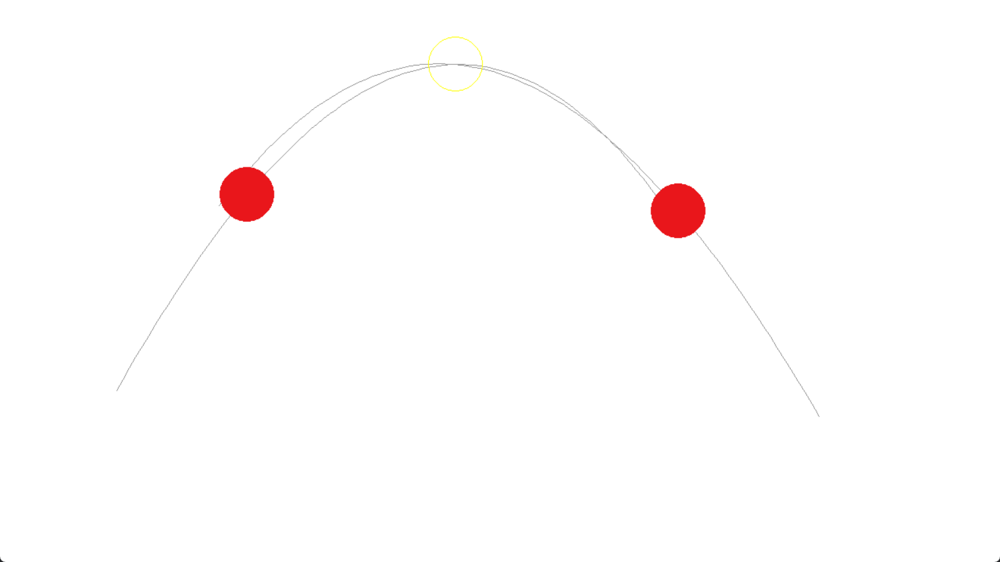
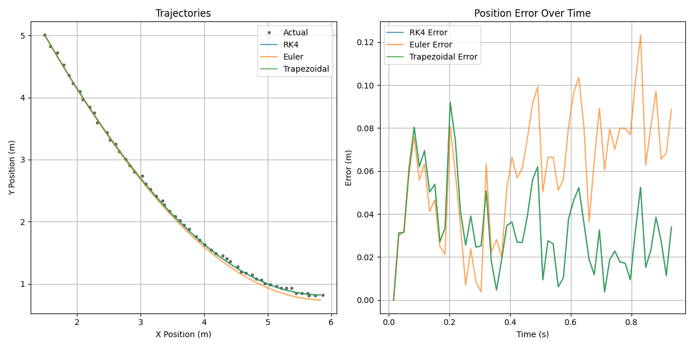

# Ball Interception System

A project that integrates **computer vision** and **numerical methods** to track, predict, and intercept moving balls in real-time. This system simulates ball motion, calculates optimal interception parameters, and demonstrates advanced physics and control techniques.

## Features

- **Real-time ball tracking:** Uses computer vision techniques (background subtraction, edge detection, contour detection) to continuously track moving balls.  
- **Trajectory prediction:** Implements multiple numerical integration methods (Forward Euler, RK4, Trapezoidal) for accurate simulation of motion under physical constraints.  
- **Optimal interception:** Uses Newton’s shooting method to compute interception parameters for a secondary ball.  
- **Collision handling:** Includes elastic collision detection and response for realistic simulation.  
- **Analytics & metrics:** Compares performance and accuracy of different numerical methods.  

## Screenshots / Visualizations

**Shooting Simulation:**  

**Method Metrics & Analysis:**  

## Technology Stack

- **Programming Language:** Python  
- **Libraries:** OpenCV, NumPy, Pygame  
- **Methods:** Numerical integration (Forward Euler, RK4, Trapezoidal), Newton’s shooting method  
- **Physics Simulation:** Real-time trajectory prediction, collision response, and damping  

## Project Insights

- Demonstrates integration of computer vision with advanced numerical methods.

- Provides a platform for testing different numerical integration methods for motion prediction.

- Can be extended for robotics, gaming, or physics-based simulations.
